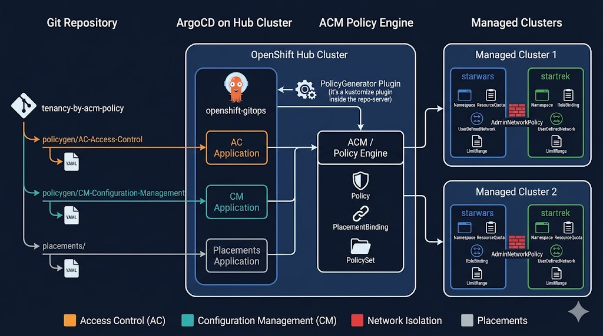

# tenancy-by-acm-policy

Use ACM PolicyGenerator with ArgoCD openshift-gitops to deliver multi-tenant isolation across managed OpenShift clusters. Tenancy boundaries — namespaces, RBAC, quotas, network isolation, MetalLB VRF/BGP — are all expressed as PolicyGenerator manifests and delivered through the default ArgoCD instance on the hub. No ACM Channels, Subscriptions or Applications are used.

Policies are organised by NIST SP 800-53 control family:
- **AC-Access-Control** — Hub and managed cluster RBAC, ACM fine-grained RBAC, MulticlusterRoleAssignments for KubeVirt workloads.
- **CM-Configuration-Management** — Tenant namespaces, ResourceQuotas, ApplicationAwareResourceQuotas (VM limits), LimitRanges, UserDefinedNetworks, MetalLB BGP peering, and AdminNetworkPolicy for cross-tenant isolation.

Templates use a base+patch model so adding a new tenant is just a new policy block in the generator YAML — no manifest duplication.

Apply in two phases — the PolicyGenerator plugin must be running before the Applications can sync:

```bash
# Phase 1: patch the default ArgoCD with the policygen plugin and wait
oc apply -f argocd/openshift-gitops-policygen.yaml
oc rollout status deployment/openshift-gitops-repo-server -n openshift-gitops

# Phase 2: create the project and applications
oc apply -f argocd/
```

Update the ACM subscription image tag in `argocd/openshift-gitops-policygen.yaml` to match your installed version (currently set to v2.16).




NOTE: If you fork and change this locally then. First find and replace the repo URL with yours.

```bash
grep -r tenancy-by-acm-policy argocd/
argocd/appproject.yaml:    - https://github.com/ngner/tenancy-by-acm-policy.git
argocd/application-ac.yaml:    repoURL: https://github.com/ngner/tenancy-by-acm-policy.git
argocd/application-cm.yaml:    repoURL: https://github.com/ngner/tenancy-by-acm-policy.git
argocd/application-placements.yaml:    repoURL: https://github.com/ngner/tenancy-by-acm-policy.git
```