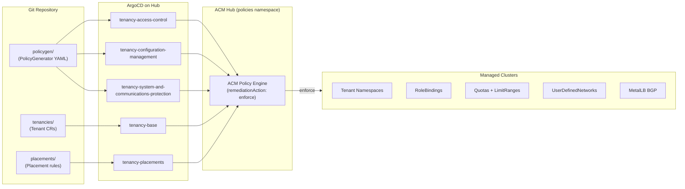

# tenancy-by-acm-policy

Use ACM PolicyGenerator with ArgoCD openshift-gitops to deliver multi-tenant isolation across managed OpenShift clusters. Tenancy boundaries — namespaces, RBAC, quotas, network isolation, MetalLB VRF/BGP — are all expressed as PolicyGenerator manifests and delivered through the default ArgoCD instance on the hub. No ACM Channels, Subscriptions or Applications are used.

Policies are organised by NIST SP 800-53 control family:
- **AC-Access-Control** — ACM fine-grained RBAC (`MulticlusterRoleAssignment`) for KubeVirt/VM access on managed clusters, hub `ClusterRoleBinding`s for ACM fleet console visibility, and managed-cluster `RoleBinding`s for Tenant-Admin/Tenant-User/Tenant-Viewer namespace access.
- **CM-Configuration-Management** — Creates tenant namespaces, ResourceQuotas, ApplicationAwareResourceQuotas (VM limits), LimitRanges, UserDefinedNetworks (OVN-isolated primary networks), and MetalLB BGP peering on managed clusters.
- **SC-System-and-Communications-Protection** — Deploys the Tenant CRD and replicates Tenant CRs from the hub to managed clusters, establishing the foundation for all other tenant policies.

A custom `Tenant` CRD (`dusty-seahorse.io/v1alpha1`) in `tenancies/` provides the single source of truth for each tenant's identity, RBAC groups, quotas, and network settings. A hub-side policy in the `tenancies` namespace uses `{{hub range hub}}` templates to replicate every `Tenant` CR to managed clusters. Managed-cluster policies then iterate those local Tenant CRs with `{{ range }}` to create namespaces, quotas, network resources, and RoleBindings. Hub-side ACM fine-grained RBAC policies generate `MulticlusterRoleAssignment`s and `ClusterRoleBinding`s directly from the Tenant CRs — adding a tenant is just creating a CR.

## How ArgoCD delivers policy to configuration

The delivery chain from git to managed-cluster resources:



Each ArgoCD Application syncs a `policygen/` folder. Kustomize runs the **PolicyGenerator plugin**, which produces ACM `Policy`, `PolicySet`, and `PlacementBinding` resources. The ACM Policy Engine evaluates these against Placements and enforces the desired state on matched clusters. The NIST family name "Configuration Management" refers to **policies that manage configuration** — ACM Policy is the delivery mechanism, and the resulting Kubernetes resources (namespaces, quotas, UDNs) are the configuration being managed.

| ArgoCD Application | NIST Family | What it creates on target clusters |
|---|---|---|
| `tenancy-access-control` | AC | ClusterRoleBindings, MulticlusterRoleAssignments, namespace RoleBindings |
| `tenancy-configuration-management` | CM | Namespaces, ResourceQuotas, AAQ, LimitRanges, UDNs, MetalLB BGP |
| `tenancy-system-and-communications-protection` | SC | Tenant CRD, tenancies namespace, replicated Tenant CRs |
| `tenancy-base` | — | Tenant CRs (source of truth) |
| `tenancy-placements` | — | Placement rules for policy targeting |

## Quick start

Apply in two phases — the PolicyGenerator plugin must be running before the Applications can sync. The `argocd/apply.sh` script handles both phases and auto-detects the current git branch for `targetRevision` (see [argocd/TESTING-BRANCHES.md](argocd/TESTING-BRANCHES.md)):

```bash
argocd/apply.sh
```

Or manually:

```bash
# Phase 1: patch the default ArgoCD with the policygen plugin and wait
oc apply -f argocd/openshift-gitops-policygen.yaml
oc rollout status deployment/openshift-gitops-repo-server -n openshift-gitops

# Phase 2: create the project and applications
oc apply -f argocd/
```

Update the ACM subscription image tag in `argocd/openshift-gitops-policygen.yaml` to match your installed version (currently set to v2.16).

## Cluster placement

Two sets of placements control which clusters receive policies:

- **`placements/policies/`** (namespace `policies`) — hub and managed-cluster placements used by AC and CM PolicyGenerators.
- **`placements/tenancies/`** (namespace `tenancies`) — placement for the Tenant CR replication policy, with its own `ManagedClusterSetBinding`. This separation allows multiple `tenancies-*` namespaces with different cluster-set bindings.

The default managed-cluster placement selects **every managed cluster except the hub** (`local-cluster`). To switch strategies, change which file is active in `placements/policies/kustomization.yaml`:

```yaml
resources:
  - placement-hub.yaml
  # Managed-cluster placement — uncomment ONE:
  - placement-managed.yaml                         # All non-hub clusters (default)
  # - placement-managed-by-clusterset.yaml  # Specific ManagedClusterSet
  # - placement-managed-by-label.yaml       # Opt-in by label
```

| File | Selects | When to use |
|---|---|---|
| `placement-managed.yaml` | Every cluster except `local-cluster`, any cluster set | Simplest — all spoke clusters get tenancy |
| `placement-managed-by-clusterset.yaml` | All clusters in a named `ManagedClusterSet` | You organise clusters into sets (`default`, `production`, etc.) |
| `placement-managed-by-label.yaml` | Clusters matching a label selector | Opt-in model — label a cluster `tenant-eligible=true` to include it |

The hub placement (`placements/policies/placement-hub.yaml`) is fixed to `local-cluster` and normally does not need changing.


## Further reading

- [Tenancy model](docs/tenancy-model.md) — personas, namespace/RBAC/UDN isolation layers, MetalLB BGP external connectivity, ACM VM console access, and VMware vCloud Director equivalents
- [Creating a new tenant](docs/new-tenant.md) — step-by-step with all configurable options (see [§1.2 ResourceQuota vs AAQ vs LimitRange](docs/new-tenant.md#12-resourcequota-vs-applicationawareresourcequota-vs-limitrange))

---

NOTE: If you fork and change this locally then first find and replace the repo URL with yours.

```bash
grep -r tenancy-by-acm-policy argocd/
argocd/appproject.yaml:    - https://github.com/ngner/tenancy-by-acm-policy.git
argocd/application-tenancy-access-control.yaml:    repoURL: https://github.com/ngner/tenancy-by-acm-policy.git
argocd/application-tenancy-configuration-management.yaml:    repoURL: https://github.com/ngner/tenancy-by-acm-policy.git
argocd/application-tenancy-placements.yaml:    repoURL: https://github.com/ngner/tenancy-by-acm-policy.git
argocd/application-tenancy-base.yaml:    repoURL: https://github.com/ngner/tenancy-by-acm-policy.git
argocd/application-tenancy-system-and-communications-protection.yaml:    repoURL: https://github.com/ngner/tenancy-by-acm-policy.git
```
