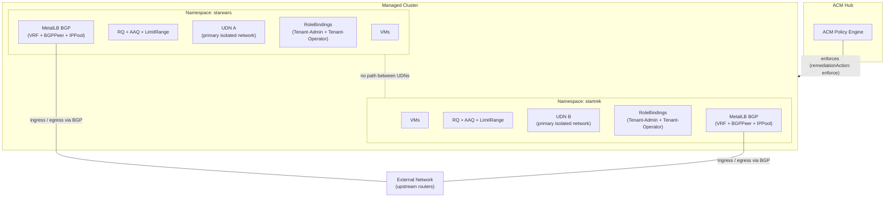
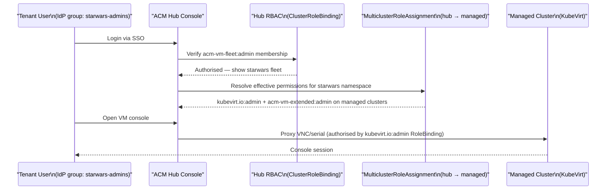
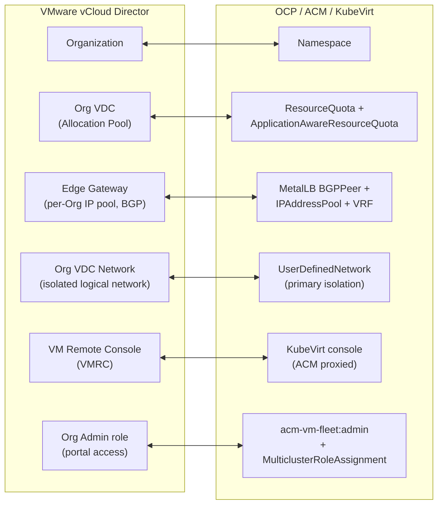

# Tenancy Model

This document describes how the policies in this repository create tenant isolation, how tenants access their virtual machines through the ACM console, and how each construct maps to an equivalent in VMware vCloud Director.

---

## 1. Personas and roles

Four personas interact with the tenancy platform. The first two are per-tenant roles implemented by the RBAC templates in this repository. The second two are platform-wide roles managed outside the tenant boundary.

| Persona | Scope | Can do | Cannot do |
|---|---|---|---|
| **Tenant-Operator** | Per-tenant namespace | Start, stop, restart and access VMs; view namespace resources | Add or delete VMs, storage, or other resources; change quotas or RBAC |
| **Tenant-Admin** | Per-tenant namespace | Add VMs, storage and services to the namespace; manage workloads | Change resource quotas, RBAC roles, or the tenant definition itself |
| **Service Provider Operator** | Platform-wide | Create new tenancies; adjust quotas and tenant parameters | Change policies, tenancy architecture, or platform components |
| **Service Provider Platform Admin** | Platform-wide | Change policies; add new components to the tenancy construct | Access namespaced tenant workloads directly |

**Tenant-Admin** maps to the `adminGroup` field in the Tenant CRD and receives the Kubernetes `admin` ClusterRole in the tenant namespace, `kubevirt.io:admin` for VM operations, and `acm-vm-fleet:admin` for hub console visibility.

**Tenant-Operator** maps to the `operatorGroup` field and receives the Kubernetes `edit` ClusterRole, `kubevirt.io:edit`, and `acm-vm-fleet:view`.

**Service Provider** roles are not per-tenant RBAC bindings. They are implemented through cluster-admin access, ArgoCD RBAC, and ACM hub console permissions. The tenancy construct enforces separation: a Service Provider Platform Admin can modify policies and tenancy definitions but has no RoleBinding in tenant namespaces; a Tenant-Admin has full namespace access but cannot alter quotas, policies, or the Tenant CRD.

---

## 2. Tenant segregation layers

A tenant boundary is formed by **four core** controls that apply to every managed cluster: **namespace**, **RBAC**, **primary network (UserDefinedNetwork)** and **Resource quotas**.

**Network isolation between tenants comes primarily from UserDefinedNetworks (UDNs):** each tenant's workloads attach to a UDN that is a **fully isolated** logical network in OVN-Kubernetes.

### Layer 1: Namespace

`policygen/CM-Configuration-Management/namespace/namespaces-from-crd.yaml`

The Kubernetes namespace is the primary unit of containment. Every tenant gets exactly one namespace per managed cluster, named after the tenant. Labels include:

- `customer-namespace: ""` — marks the namespace as a tenant workload boundary.
- `k8s.ovn.org/primary-user-defined-network: ""` — opts the namespace into using its **UserDefinedNetwork** as the primary pod/VM network (see Layer 3).

All other controls — RBAC, quotas, network policies — are scoped to this namespace unless cluster-scoped.

### Layer 2: RBAC

`policygen/AC-Access-Control/rbac/managed-rolebindings.yaml`

RoleBindings inside the tenant namespace grant the tenant's IdP groups permission to manage resources within that namespace only. Two tiers are provisioned per tenant:

- **Tenant-Admin group** (`kubevirt.io:admin`, namespace `admin` role) — full control over VMs and namespace resources
- **Tenant-Operator group** (`kubevirt.io:edit`, namespace `edit` role) — can run and modify VMs but cannot change RBAC or quotas

These are standard Kubernetes RoleBindings — they grant no visibility into other tenants' namespaces, and no cluster-level permissions. Access to the ACM console and cross-cluster propagation is handled separately (see section 3).

### Layer 3: Primary network isolation — UserDefinedNetwork

`policygen/CM-Configuration-Management/network/udn-from-crd.yaml`

Each tenant receives a dedicated `UserDefinedNetwork` (UDN). It is configured as the **primary** network for the namespace, so VM interfaces attach to this network by default.

**Why this isolates tenants:** OVN-Kubernetes implements each UDN as its **own isolated virtual network**. Each UDN is an additional OVN Layer 2 Network isolated from the other networks in the cluster.

**Address spaces:** You still define `spec.layer2.subnets[]` (or equivalent) for addressing **inside that tenant's network** (guest IPs, services, operations). That choice is **independent of isolation**: tenants **may reuse** the same CIDR ranges; overlap **does not** merge networks or create routing between UDNs.

### Layer 4: External connectivity — MetalLB BGP

`policygen/CM-Configuration-Management/metallb/`

Each tenant can receive its own MetalLB BGP peering session in a dedicated VRF for isolated ingress and egress to external networks. This creates three resources per tenant:

- **BGPPeer** — establishes a BGP session with the upstream router
- **IPAddressPool** — assigns a range of external IPs to the tenant's services
- **BGPAdvertisement** — advertises the tenant's service IPs via the BGP session

External connectivity is separate from isolation between tenants. MetalLB VRF/BGP provides **north/south** traffic paths; UDN provides **east/west** isolation.

### Isolation summary

### Resource caps (sizing, not isolation)

Quotas and LimitRanges **do not replace** network or RBAC isolation; they cap **how much** a tenant may consume in their own namespace:

| Control | What it bounds |
| --- | --- |
| **ResourceQuota** | **Total** CPU/memory/pods/storage **requests** summed over **all** pods and PVCs in the namespace. |
| **ApplicationAwareResourceQuota** (**AAQ**) | **Total** CPU/memory attributed to **KubeVirt VMIs** only (the `…/vmi` counters). Parallel to ResourceQuota — both must allow a new VM to schedule. |
| **LimitRange** | **Per** object **maximums only** here (no defaults): caps the **largest** single container pod and **per-PVC** size so VM launcher and service pods must declare their own requests. |

For the full distinction and default numbers, see **[Creating a new tenant — section 1.2](new-tenant.md#12-resourcequota-vs-applicationawareresourcequota-vs-limitrange)**.

---

## 3. VM console access via ACM

Tenant users access their VMs through the ACM hub console without needing a direct login to any managed cluster. This is enabled by a two-tier RBAC model that the hub policies establish.

### Tier 1 — ACM console visibility (hub cluster)

`policygen/AC-Access-Control/policygenerator-hub.yaml`

A `ClusterRoleBinding` on the hub grants each tenant group one of the `acm-vm-fleet` roles:

| Group tier | Hub ClusterRole | Effect |
|---|---|---|
| Tenant-Admin | `acm-vm-fleet:admin` | Can see and manage their VM fleet in the ACM console |
| Tenant-Operator | `acm-vm-fleet:view` | Read-only view of their VM fleet in the ACM console |

This controls what the tenant sees in the ACM UI. Without it, the tenant group has no console visibility even if they have direct cluster access.

### Tier 2 — VM operations (managed clusters, via MulticlusterRoleAssignment)

`policygen/AC-Access-Control/acm-finegrained-rbac/hub-mcra-virt.yaml` (generated via `object-templates-raw` from Tenant CRs)

A `MulticlusterRoleAssignment` (`rbac.open-cluster-management.io/v1beta1`) is created on the hub and evaluated by ACM's fine-grained RBAC controller. It propagates RoleBindings to every cluster matched by the Placement, scoped to the tenant namespace.

| Group tier | KubeVirt role | ACM extended role |
|---|---|---|
| Tenant-Admin | `kubevirt.io:admin` | `acm-vm-extended:admin` |
| Tenant-Operator | `kubevirt.io:edit` | `acm-vm-extended:view` |

- `kubevirt.io:admin`/`edit` — allows the ACM console to proxy the VM's VNC and serial console on behalf of the user; also grants power operations (start, stop, restart, live migrate).
- `acm-vm-extended:admin`/`view` — grants access to extended VM management actions exposed through the ACM console (snapshots, clone, etc.).

The tenant group **never needs a kubeconfig or direct API access** to the managed cluster. The ACM console acts as a proxy, and the `MulticlusterRoleAssignment` ensures the necessary authorisation is in place on the target cluster.

### Console access flow

### What each role allows

| Action | acm-vm-fleet:admin | acm-vm-fleet:view | kubevirt.io:admin | kubevirt.io:edit |
|---|:---:|:---:|:---:|:---:|
| See VMs in ACM console | Y | Y | — | — |
| Start / stop / restart VM | — | — | Y | Y |
| Open VNC / serial console | — | — | Y | Y |
| Edit VM spec | — | — | Y | Y |
| Delete VM | — | — | Y | N |
| View VM (read-only) | — | — | Y | Y |

---

## 4. VMware vCloud Director equivalents

This section is aimed at teams migrating from or familiar with vCloud Director. The table maps constructs in this repository to their nearest vCD counterpart.

| OCP / ACM / KubeVirt construct | VMware vCloud Director equivalent | Notes |
|---|---|---|
| Kubernetes **Namespace** | **vCD Organization (Org)** | Primary tenancy boundary and administrative unit. One per tenant. |
| **ResourceQuota** | **Org VDC Allocation Pool / Pay-As-You-Go model** | **Namespace total** — caps summed CPU/memory/pods/PVC storage for **all** workloads in the tenant. |
| **ApplicationAwareResourceQuota** (AAQ) | **VM-only reservation / VM quota** within an Org VDC | **VMI aggregate** — caps total VM compute using `/vmi` counters; complements ResourceQuota; does not replace it. |
| **LimitRange** | **Max VM size / max disk per vApp component** | **Per object** — here, **max only** (no default sizing); workloads declare their own reservations. |
| **UserDefinedNetwork** (OVN) | **Isolated Org VDC network** | **Primary inter-tenant isolation** for workloads on that network — logically separate from other tenants; **overlapping IP plans** across Orgs/UDNs are normal and do not break isolation. |
| **MetalLB BGPPeer + IPAddressPool + VRF** | **vCD Edge Gateway + External Network** | Per-tenant north/south connectivity; distinct from UDN-to-UDN isolation. |
| **RoleBinding** (`admin` / `edit` in namespace) | **vCD Org Administrator / vApp Author role** | Grants tenant users rights scoped to their Org/namespace. No cross-tenant visibility. |
| **ACM MulticlusterRoleAssignment** (`kubevirt.io:admin`) | **vCD Organization Administrator** with VDC rights | Propagates KubeVirt VM management rights across clusters, scoped to the tenant namespace. Equivalent to giving an Org Admin the right to manage VMs within their Org VDC. |
| **ACM fleet ClusterRoleBinding** (`acm-vm-fleet:admin`) | **vCD Tenant Portal access** for Org Administrators | Grants visibility into the management console (ACM / vCD tenant portal) for the tenant's group. Without it, the tenant cannot see the console even with underlying cluster rights. |
| **KubeVirt VM console** (ACM proxied via `kubevirt.io:admin`) | **vCD VM Remote Console (VMRC)** via tenant portal | Browser-based VM console access proxied through the management plane. Neither the ACM user nor the vCD tenant user needs direct hypervisor access. |
| **ACM Policy** (`remediationAction: enforce`) | **vCD Defined Entities / Org Policies** | Declarative enforcement — if a resource drifts from the desired state, ACM re-applies it. vCD Defined Entities provide similar schema-enforced resource governance within an Org. |

### Conceptual mapping

