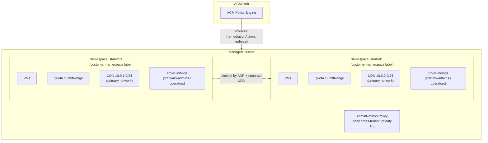
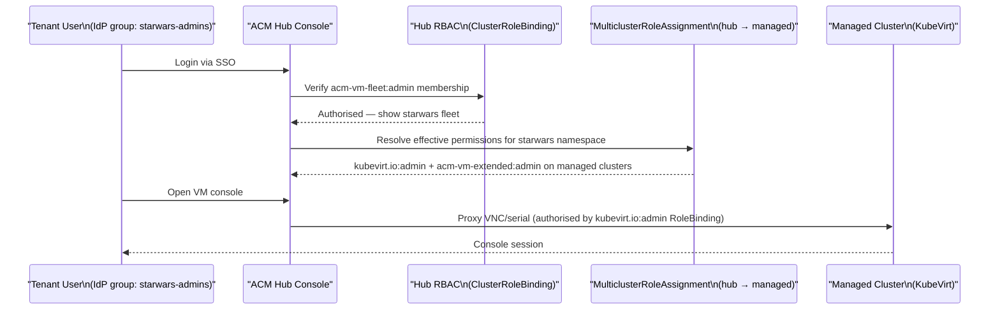
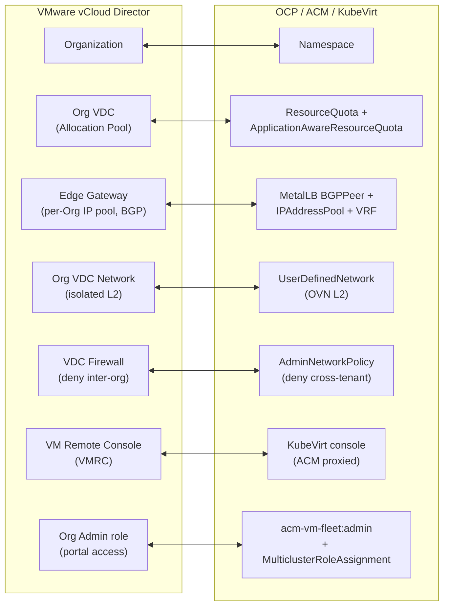

# Tenancy Model

This document describes how the policies in this repository create tenant isolation, how tenants access their virtual machines through the ACM console, and how each construct maps to an equivalent in VMware vCloud Director.

---

## 1. Tenant segregation layers

A tenant boundary is formed by four independent isolation layers that are enforced together. Each layer is applied to every managed cluster by ACM policy — a tenant cannot exist without all four.

### Layer 1: Namespace

`policygen/CM-Configuration-Management/namespace/namespace.yaml`

The Kubernetes namespace is the primary unit of containment. Every tenant gets exactly one namespace per managed cluster, named after the tenant. Two labels are applied at creation:

- `customer-namespace: ""` — marks the namespace as a tenant boundary; used by the AdminNetworkPolicy to apply cluster-wide isolation automatically to every tenant namespace without listing them individually.
- `k8s.ovn.org/primary-user-defined-network: ""` — opts the namespace into its dedicated OVN overlay network (see Layer 4).

All other controls — RBAC, quotas, network policies — are scoped to this namespace.

### Layer 2: RBAC

`policygen/AC-Access-Control/rbac/rolebinding.yaml`

RoleBindings inside the tenant namespace grant the tenant's IdP groups permission to manage resources within that namespace only. Two tiers are provisioned per tenant:

- **Admin group** (`kubevirt.io:admin`, namespace `admin` role) — full control over VMs and namespace resources
- **Operator group** (`kubevirt.io:edit`, namespace `edit` role) — can run and modify VMs but cannot change RBAC or quotas

These are standard Kubernetes RoleBindings — they grant no visibility into other tenants' namespaces, and no cluster-level permissions. Access to the ACM console and cross-cluster propagation is handled separately (see section 2).

### Layer 3: Network isolation (AdminNetworkPolicy)

`policygen/CM-Configuration-Management/network-policy/admin-network-policy.yaml`

An `AdminNetworkPolicy` (priority 10) denies all ingress and egress between any two namespaces labelled `customer-namespace`. This policy is cluster-wide and operates below the pod level via OVN-Kubernetes — it cannot be overridden by namespace-scoped NetworkPolicies created by a tenant.

Key properties:
- **Automatic scope** — any new tenant namespace with the `customer-namespace` label is immediately subject to the policy; no per-tenant rule is needed.
- **Non-overridable** — AdminNetworkPolicy is an admin-tier construct; tenant users cannot modify or delete it.
- **Defence-in-depth** — even if the UDN subnets were misconfigured to share an address space, the ANP would still block cross-tenant traffic.

### Layer 4: Network address space (UserDefinedNetwork)

`policygen/CM-Configuration-Management/network/user-defined-network.yaml`

Each tenant receives a dedicated OVN-Kubernetes `UserDefinedNetwork` with a unique Layer 2 subnet. This is set as the **primary** network for the namespace, meaning all VM interfaces attach to this network by default.

Because each tenant's UDN is a separate overlay network segment, VMs in different tenant namespaces have no Layer 2 reachability to each other — even before the AdminNetworkPolicy is consulted. This provides a second, independent network isolation boundary.

External connectivity is provided per-tenant via MetalLB VRF/BGP (`metallb-bgp-peer.yaml`, `metallb-ip-pool.yaml`, `metallb-bgp-advertisement.yaml`) — each tenant gets its own BGP peer, VRF, and IP address pool, so egress/ingress traffic is also isolated at the routing layer.

### Isolation summary

---

## 2. VM console access via ACM

Tenant users access their VMs through the ACM hub console without needing a direct login to any managed cluster. This is enabled by a two-tier RBAC model that the hub policies establish.

### Tier 1 — ACM console visibility (hub cluster)

`policygen/AC-Access-Control/policyGenerator-hub.yaml`

A `ClusterRoleBinding` on the hub grants each tenant group one of the `acm-vm-fleet` roles:

| Group tier | Hub ClusterRole | Effect |
|---|---|---|
| Admin | `acm-vm-fleet:admin` | Can see and manage their VM fleet in the ACM console |
| Operator | `acm-vm-fleet:view` | Read-only view of their VM fleet in the ACM console |

This controls what the tenant sees in the ACM UI. Without it, the tenant group has no console visibility even if they have direct cluster access.

### Tier 2 — VM operations (managed clusters, via MulticlusterRoleAssignment)

`policygen/AC-Access-Control/acm-finegrained-rbac/multiclusterroleassignment-virt.yaml`

A `MulticlusterRoleAssignment` (`rbac.open-cluster-management.io/v1beta1`) is created on the hub and evaluated by ACM's fine-grained RBAC controller. It propagates RoleBindings to every cluster matched by the Placement, scoped to the tenant namespace.

| Group tier | KubeVirt role | ACM extended role |
|---|---|---|
| Admin | `kubevirt.io:admin` | `acm-vm-extended:admin` |
| Operator | `kubevirt.io:edit` | `acm-vm-extended:view` |

- `kubevirt.io:admin`/`edit` — allows the ACM console to proxy the VM's VNC and serial console on behalf of the user; also grants power operations (start, stop, restart, live migrate).
- `acm-vm-extended:admin`/`view` — grants access to extended VM management actions exposed through the ACM console (snapshots, clone, etc.).

The tenant group **never needs a kubeconfig or direct API access** to the managed cluster. The ACM console acts as a proxy, and the `MulticlusterRoleAssignment` ensures the necessary authorisation is in place on the target cluster.

### Console access flow

### What each role allows

| Action | acm-vm-fleet:admin | acm-vm-fleet:view | kubevirt.io:admin | kubevirt.io:edit |
|---|:---:|:---:|:---:|:---:|
| See VMs in ACM console | Y | Y | — | — |
| Start / stop / restart VM | — | — | Y | Y |
| Open VNC / serial console | — | — | Y | Y |
| Edit VM spec | — | — | Y | Y |
| Delete VM | — | — | Y | N |
| View VM (read-only) | — | — | Y | Y |

---

## 3. VMware vCloud Director equivalents

This section is aimed at teams migrating from or familiar with vCloud Director. The table maps every construct in this repository to its nearest vCD counterpart.

| OCP / ACM / KubeVirt construct | VMware vCloud Director equivalent | Notes |
|---|---|---|
| Kubernetes **Namespace** | **vCD Organization (Org)** | Primary tenancy boundary and administrative unit. One per tenant. |
| **ResourceQuota** | **Org VDC Allocation Pool / Pay-As-You-Go model** | Sets CPU, memory, pod, and storage ceilings for the tenant. Equivalent to the vCPU / RAM / storage limits on an Org VDC. |
| **ApplicationAwareResourceQuota** (AAQ) | **VM-level Allocation Pool** in an Org VDC | Specifically limits compute consumed by running VMs (`/vmi` resources), analogous to vCD guaranteeing reservations per Org VDC for VM workloads. |
| **LimitRange** | **VM Sizing Policies / Compute Policies** | Defines default and maximum CPU/memory per container or VM. Similar to vCD VM placement and sizing policies applied to an Org VDC. |
| **UserDefinedNetwork** (OVN L2) | **Org VDC Network** (isolated or internally-routed) | Per-tenant private Layer 2 overlay network. In vCD, an isolated Org VDC network provides the same L2 isolation with no external routing by default. |
| **MetalLB BGPPeer + IPAddressPool + VRF** | **vCD Edge Gateway + External Network** | Provides isolated external ingress/egress per tenant with a dedicated IP pool. In vCD, each Org gets its own Edge Gateway connected to a provider external network with a dedicated IP range. |
| **AdminNetworkPolicy** (`deny cross-tenant`) | **vCD Org VDC Firewall** (default deny between Orgs) | In vCD, traffic between different Org VDC networks is blocked by default at the Edge Gateway. The ANP provides the equivalent enforcement in OVN-Kubernetes. |
| **RoleBinding** (`admin` / `edit` in namespace) | **vCD Org Administrator / vApp Author role** | Grants tenant users rights scoped to their Org/namespace. No cross-tenant visibility. |
| **ACM MulticlusterRoleAssignment** (`kubevirt.io:admin`) | **vCD Organization Administrator** with VDC rights | Propagates KubeVirt VM management rights across clusters, scoped to the tenant namespace. Equivalent to giving an Org Admin the right to manage VMs within their Org VDC. |
| **ACM fleet ClusterRoleBinding** (`acm-vm-fleet:admin`) | **vCD Tenant Portal access** for Org Administrators | Grants visibility into the management console (ACM / vCD tenant portal) for the tenant's group. Without it, the tenant cannot see the console even with underlying cluster rights. |
| **KubeVirt VM console** (ACM proxied via `kubevirt.io:admin`) | **vCD VM Remote Console (VMRC)** via tenant portal | Browser-based VM console access proxied through the management plane. Neither the ACM user nor the vCD tenant user needs direct hypervisor access. |
| **ACM Policy** (`remediationAction: enforce`) | **vCD Defined Entities / Org Policies** | Declarative enforcement — if a resource drifts from the desired state, ACM re-applies it. vCD Defined Entities provide similar schema-enforced resource governance within an Org. |
| **AdminNetworkPolicy** + **UDN** (dual isolation) | **vCD network isolation** (Edge + Org VDC firewall) | vCD relies on Edge Gateway rules + Org VDC network isolation for the equivalent dual-layer approach. The OCP model enforces this at the OVN level, making it non-bypassable by tenant users. |

### Conceptual mapping

